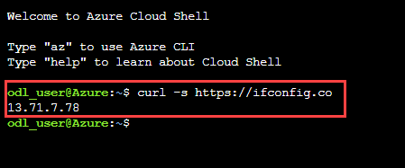

# Getting started with Hyperscale (Citus)

In order to use the Azure Portal Cloud Shell to connect to the Hyperscale (Citus) server group we will need to create a storage account. The storage account allows you to save files associated with the Cloud Shell so you may use them in various Azure portal activities like running scripts, downloading data files and managing Azure resources.

## **Lab 1: Create a Cloud Shell**

1.On the portal banner click on the **Cloud Shell icon**.

  

2.On the Welcome to Azure Cloud Shell click **Bash**.

  

3.On the You have no storage mounted screen click **Show advanced settings**.
 
  

4.Use the default values for subscription and region and for:
- **Resource Group** - Select **Use Existing** that is **citus-xxxx**
- **Storage Account** - name for storage accound should be unique, as in **sa131507**
- **File Share** - name for storage accound should be unique, as in **fs131507**
Then click **Create**.

 
  
 > **Note**: This may take up to a minute to create and start the Cloud Shell.
   
5.We will need the client IP address of Cloud Shell to configure the firewall in the next step. At the command prompt enter the following command then copy or note the IP address of your cloud shell.

```
curl -s https://ifconfig.co 
```

   

> **Note**: To paste in the bash console right click and choose paste.

6.Click **Next** on the bottom right of this page.
