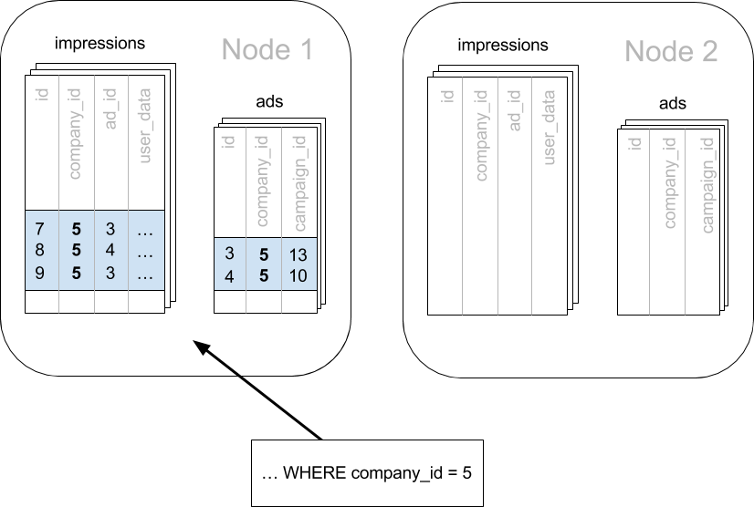
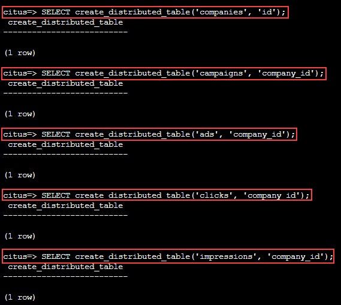

# Scaling the Relational Data Model

The relational data model is great for applications. It protects data integrity, allows flexible queries, and accommodates changing data. Traditionally the only problem was that relational databases weren’t considered capable of scaling to the workloads needed for big SaaS applications. Developers had to put up with NoSQL databases – or a collection of backend services – to reach that size.

With Hyperscale(Citus) you can keep your data model and make it scale. Hyperscale(Citus) appears to applications as a single PostgreSQL database, but it internally routes queries to an adjustable number of physical servers (nodes) which can process requests in parallel.

Multi-tenant applications have a nice property that we can take advantage of: queries usually always request information for one tenant at a time, not a mix of tenants. For instance, when a salesperson is searching prospect information in a CRM, the search results are specific to his employer; other businesses’ leads and notes are not included.

Because application queries are restricted to a single tenant, such as a store or company, one approach for making multi-tenant application queries fast is to store all data for a given tenant on the same node. This minimizes network overhead between the nodes and allows Hyperscale(Citus) to support all your application’s joins, key constraints and transactions efficiently. With this, you can scale across multiple nodes without having to totally re-write or re-architect your application.

  

We do this in Hyperscale(Citus) by making sure every table in our schema that is related to the tenant has a column to clearly mark which tenant owns which rows. In the advertising operational analytics application the tenants are companies, so we must ensure all tables that are related to a company have a company_id column. These tables are called distributed tables. 

For example: Campaigns table should have company_id column because campaigns are for companies. Same is with ads, clicks and impressions.
So in this example company_id will be the “distribution column” (also called sharding key or distribution key). This means we would shard/distribute all the tables across worker nodes using the company_id. This makes all the tables colocated. This means that all the data related to a single company for all tables is on the same worker node. This way we can tell Hyperscale(Citus) to use this column to read and write rows to the same node when the rows are marked for the same company. 

As an example, in the above diagram all the rows on all tables for company_id 5 are on the same worker node.
At this point feel free to follow along in your own Hyperscale(Citus) cluster by downloading and executing the SQL to create the schema. Once the schema is ready, we can tell Hyperscale(Citus) to create shards on the workers.

### **Shard tables across nodes**

The create_distributed_table function informs Hyperscale(Citus) that a table should be distributed among nodes and that future incoming queries to those tables should be planned for distributed execution. The function also creates shards for the table on worker nodes, which are low-level units of data storage Hyperscale(Citus) uses to assign data to nodes.
This specific example will scale the application you created by sharding the tables across the database based on company_id.

1.In the bash console copy and paste the following to create the distribution key (shard)

```
SELECT create_distributed_table('companies', 'id'); 
```

```
SELECT create_distributed_table('campaigns', 'company_id'); 
```

```
SELECT create_distributed_table('ads', 'company_id'); 
```

```
SELECT create_distributed_table('clicks', 'company_id'); 
```

```
SELECT create_distributed_table('impressions', 'company_id'); 
```

  

2.Click **Next** at the bottom right of this window.

