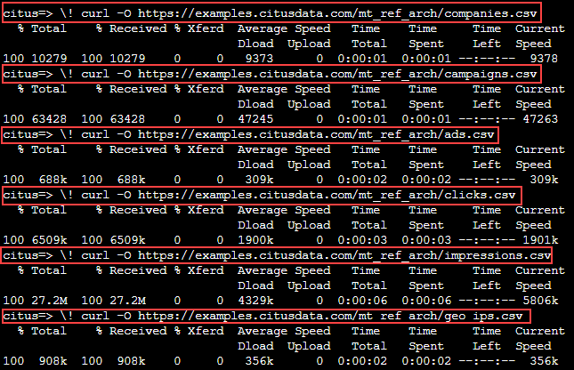
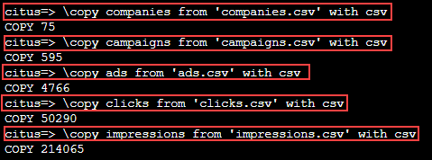

# Ingesting Data

In the previous section we identified the correct distribution column for our multi-tenant application: the company id. Even in a single-machine database it can be useful to denormalize tables with the addition of company id, whether it be for row-level security or for additional indexing. The extra benefit, as we saw, is that including the extra column helps for multi-machine scaling as well.

The next step is loading sample data into the cluster from the command line.

## **Lab 5: Download and ingest the data from the shell**

1.In the bash console copy and paste the following commands to download the sample data.

```
\! curl -O https://examples.citusdata.com/mt_ref_arch/companies.csv 
```

```
\! curl -O https://examples.citusdata.com/mt_ref_arch/campaigns.csv 
```

```
\! curl -O https://examples.citusdata.com/mt_ref_arch/ads.csv 
```

```
\! curl -O https://examples.citusdata.com/mt_ref_arch/clicks.csv 
```

```
\! curl -O https://examples.citusdata.com/mt_ref_arch/impressions.csv 
```

```
\! curl -O https://examples.citusdata.com/mt_ref_arch/geo_ips.csv 
```

  
  
Being an extension of PostgreSQL, Hyperscale(Citus) supports bulk loading with the COPY command. Use it to ingest the data you downloaded and make sure that you specify the correct file path if you downloaded the file to some other location.

2.In the bash console copy and paste the following to load the tables.

```
\copy companies from 'companies.csv' with csv 
```
 
```
\copy campaigns from 'campaigns.csv' with csv 
```

```
\copy ads from 'ads.csv' with csv 
```

```
\copy clicks from 'clicks.csv' with csv 
```

```
\copy impressions from 'impressions.csv' with csv 
```   

  
  
3.Click **Next** at the bottom right of this window.
