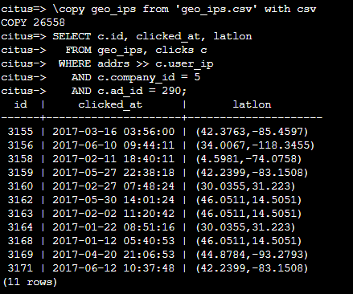

# Sharing Data Between Tenants with Reference Tables

Until now all tables have been distributed by company_id, but sometimes there is data that can be shared by all tenants, and doesn’t “belong” to any tenant in particular. For instance, all companies using this example ad platform might want to get geographical information for their audience based on IP addresses. In a single machine database this could be accomplished by a lookup table for geo-ip, like the following. (A real table would probably use PostGIS but bear with the simplified example.)

## **Lab 7: Create a table to hold shared geographic information**

1.In the bash console copy and paste the following to create the geo_ips table.

```
CREATE TABLE geo_ips (
  addrs cidr NOT NULL PRIMARY KEY,
  latlon point NOT NULL
    CHECK (-90  <= latlon[0] AND latlon[0] <= 90 AND
           -180 <= latlon[1] AND latlon[1] <= 180)
);
CREATE INDEX ON geo_ips USING gist (addrs inet_ops); 
```

  
  
To use this table efficiently in a distributed setup, we need to find a way to co-locate the geo_ips table with clicks for not just one—but every—company. That way, no network traffic need be incurred at query time. We do this in Hyperscale (Citus) by designating geo_ips as a reference table which will store a copy of the table on every worker node.

2.In the bash console copy and paste the following to create a geo_ips table

```
-- Make synchronized copies of geo_ips on all workers

SELECT create_reference_table('geo_ips');
```

  
  
Reference tables are replicated across all worker nodes, and Hyperscale (Citus) automatically keeps them in sync during modifications. Notice that we call create_reference_table rather than create_distributed_table.
	 
3.In the bash console copy and paste the following to load geo_ips with data.

```
\copy geo_ips from 'geo_ips.csv' with csv
```

  
  
Now joining clicks with this table will execute efficiently on all nodes. Lets ask for the locations of everyone who clicked on ad 290.
	 
4.In the bash console copy and paste the following to execute the select statement

```
SELECT c.id, clicked_at, latlon
  FROM geo_ips, clicks c
 WHERE addrs >> c.user_ip
   AND c.company_id = 5
   AND c.ad_id = 290;
 ```

  
  
5.Click **Next** at the bottom right of this window.
